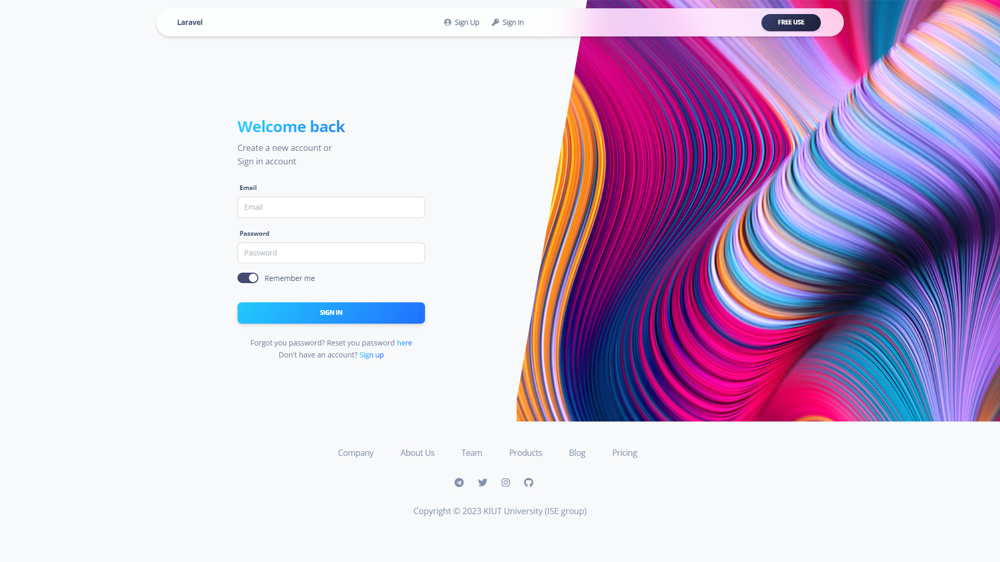
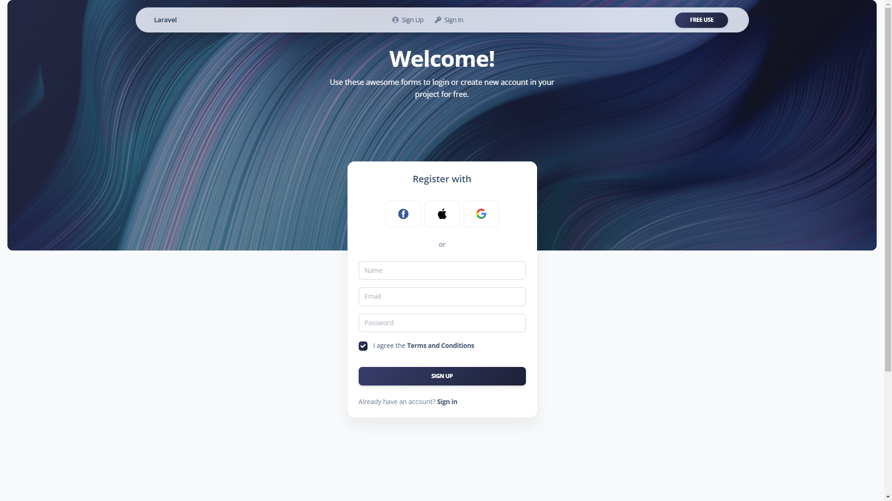
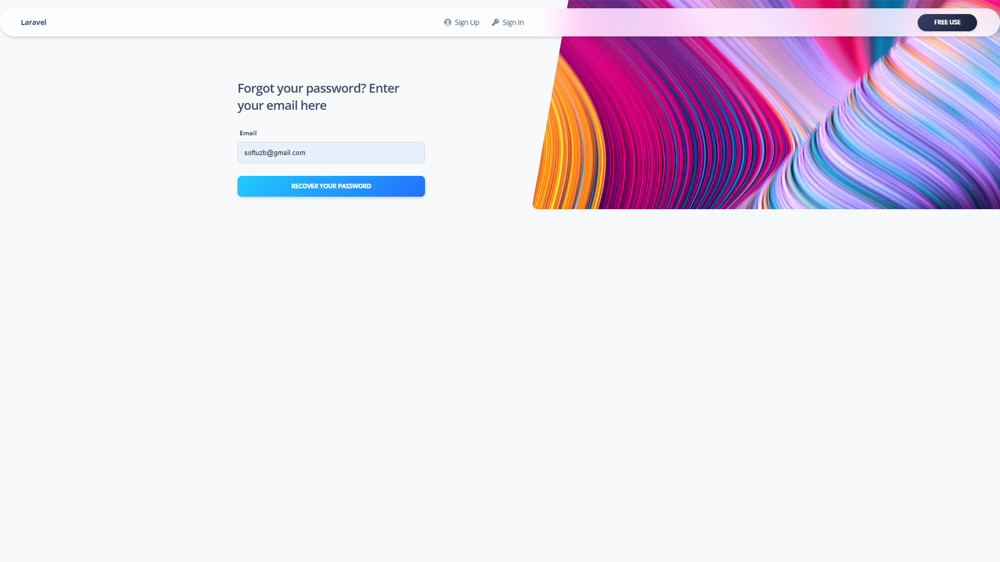

## Web CV Generator


```shell
composer install
```

```shell
npm install
```

```shell
php artisan storage:link
```

```shell
php artisan key:generate
```

Set .env database variables
```dotenv
DB_CONNECTION=mysql
DB_HOST=127.0.0.1
DB_PORT=3306
DB_DATABASE=pbl-vendor
DB_USERNAME=root
DB_PASSWORD=
```

```shell
php artisan migrate
```

```shell
php artisan optimize:clear
```

Run Laravel server
```shell
php artisan serve
```

Run Vite server (Frontend)
```shell
npm run dev
```


### Database Diagram:
```
https://dbdiagram.io/d/63f460ce296d97641d827b4d
```

### Admin Panel:



