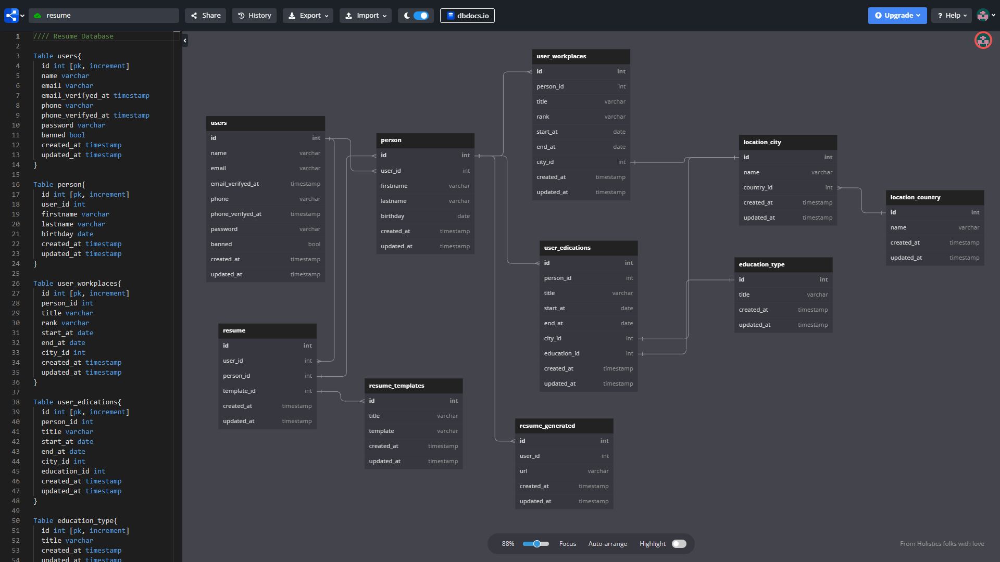

# Web CV Generator


## About Porject
> Some information ...

## Requirements
- PHP ^8.0.2
- Composer 2
- Laravel v10
- npm v9.6.0
- node v18.1.0
- Bootstrap v5

## Laravel required PHP Extensions
- OpenSSL PHP Extension
- PDO PHP Extension
- Mbstring PHP Extension
- Tokenizer PHP Extension
- XML PHP Extension

## Install guide

```shell
composer install
```

```shell
npm install
```

```shell
cp .env.example .env
```

```shell
php artisan key:generate
```

```shell
php artisan storage:link
```

Set .env database variables
```dotenv
DB_CONNECTION=mysql
DB_HOST=127.0.0.1
DB_PORT=3306
DB_DATABASE=pbl-vendor
DB_USERNAME=root
DB_PASSWORD=
```

```shell
php artisan optimize:clear
```

```shell
php artisan migrate --seed
```

Run Laravel server
```shell
php artisan serve
```

Run Vite server (Frontend)
```shell
npm run dev
```

## Demo Datas
> User: user@kiut.uz
> Password: password
>
> Admin: admin@kiut.uz
> Password: password

## Database Diagram

- https://dbdiagram.io/d/63f460ce296d97641d827b4d

## Screenshots


## Used articles
- https://www.creative-tim.com/product/soft-ui-dashboard

## Support
> If there are any problems, please leave a issue
>
[ > Click on the link to write a issue](https://github.com/KIUT-Projects/web-cv-generator/issues)

## Authors
- ISE-51U - Umarov Kamoliddin ([@UzSoftic](https://github.com/uzsoftic))
- ISE-51U - Abdukhamidov Abdurakhmon ([@AbdurakhmonAbdukhamidov](https://github.com/AbdurakhmonAbdukhamidov))
- ISE-51U - Zokirov Hojiakbar ([@Khojiakbar07](https://github.com/Khojiakbar07))

## Versions
- v0.1 - Pre release
- ...
